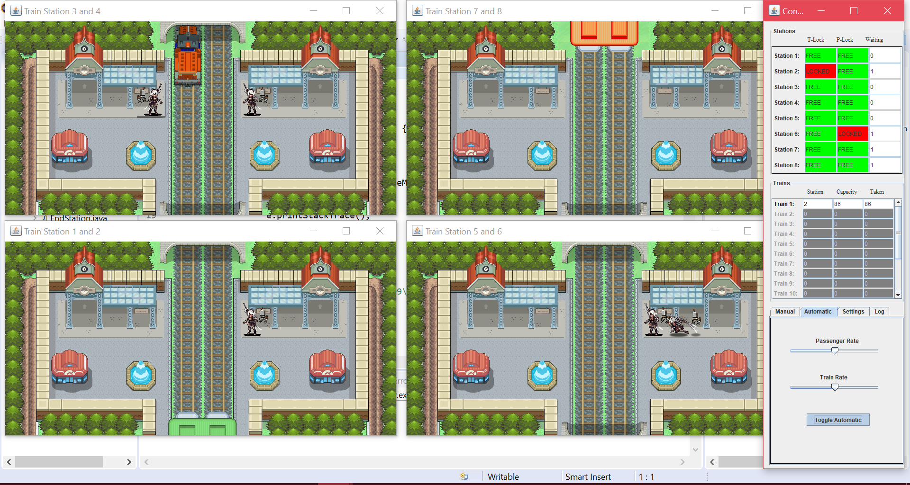

# train-synchronization-simulation
A simulation of a train automation system implemented in Java.

Demonstrates understanding of synchronization primitives such as semaphores.

Includes a technical report detailing performance differences between using semaphores or monitors.

